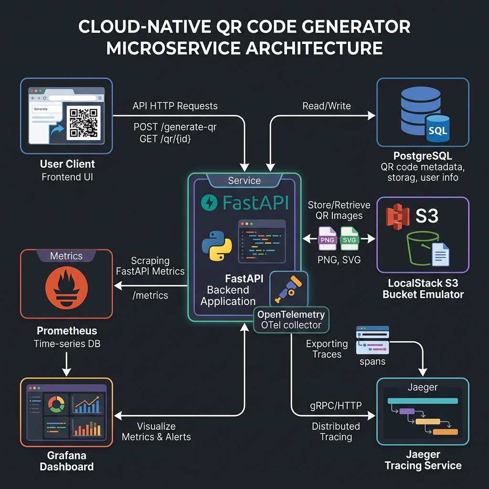

# BULUT MİMARİLERİNDE TEST MÜHENDİSLİĞİ DÖNEM PROJESİ
## Q-Flow: Bulut Tabanlı, Dinamik ve Uçtan Uca Takip Edilebilir QR Kod Yönetim Sistemi

**Öğrenciler:**  
* Şevval Çulcu (171423961)  
* Yusuf Durmuş (170423965)  

---

### Özet
Bu proje kapsamında, MTH2526-B25 Bulut Mimarilerinde Test Mühendisliği dersinin dönem projesi şartnamesine uygun olarak, bulut bilişim ve test otomasyonu prensiplerini entegre eden "Q-Flow" adlı mikroservis tabanlı bir QR Kod Oluşturma ve Yönlendirme Takip Servisi tasarlanmış ve hayata geçirilmiştir. Proje, modern yazılım yaşam döngüsünde (SDLC) kullanılan birim (unit), entegrasyon (integration), uçtan uca (E2E), ve performans test otomasyon zincirlerini içermektedir. Altyapı olarak Kubernetes, Helm, KEDA ve ArgoCD gibi bulut-yerel (cloud-native) teknolojiler kullanılmış; sistem kalitesi ve gözlemlenebilirliği ise Prometheus, Grafana, OpenTelemetry ve Jaeger ile sağlanmıştır.

---

### 1. Giriş
Geleneksel statik QR kodları, basıldıktan sonra içerdikleri linklerin değiştirilememesi ve kaç kez tarandığının takip edilememesi gibi kısıtlamalara sahiptir. Bu projede geliştirilen **Q-Flow**, dinamik bir yönlendirme katmanı ekleyerek bu sorunları çözer. Kullanıcı bir QR kod ürettiğinde, QR kod doğrudan hedef URL'e değil, Q-Flow servisinin yönlendirici (`/qr/{id}`) endpoint'ine işaret eder. Sistem, yönlendirme isteğini aldığında veritabanındaki tarama sayacını (scan count) günceller ve ardından kullanıcıyı hedef URL'e yönlendirir.

Projenin amacı karmaşık iş mantığı barındıran bir uygulama yazmak değil; basit ama gerçekçi bir mikroservis için endüstri standartlarında test otomasyonu, sürekli entegrasyon (CI/CD), gözlemlenebilirlik (observability) ve otomatik ölçekleme (autoscaling) altyapısı kurmaktır.

---

### 2. Mimari Tasarım
Sistemin genel mimarisi, gevşek bağlı (loosely coupled) ve bağımsız ölçeklenebilir bileşenlerden oluşmaktadır. 

- **Arayüz (Frontend)**: FastAPI tarafından sunulan modern, responsive ve glassmorphic tasarıma sahip bir HTML/CSS/JS arayüzüdür. Kullanıcılar bu ekran üzerinden QR kodları oluşturabilir, mevcut kodları listeleyebilir, yönlendirmeleri test edebilir ve kodları silebilir.
- **Uygulama Sunucusu (FastAPI)**: REST API isteklerini yöneten, QR kod görsel matrisini üreten ve gözlemlenebilirlik araçlarını barındıran Python tabanlı asenkron mikroservistir.
- **Veritabanı (PostgreSQL)**: QR kodlarının metadata bilgilerini (başlık, hedef URL, S3 anahtarı, tarama sayısı ve oluşturulma tarihi) saklayan ilişkisel veritabanıdır.
- **Nesne Depolama (AWS S3 / LocalStack)**: Üretilen PNG formatındaki QR kod görselleri, yerel olarak emüle edilen LocalStack S3 servisinde saklanır.
- **İzleme ve Dağıtık Takip (OpenTelemetry + Jaeger)**: Uygulamaya gelen isteklerin, veritabanı sorgularının ve S3 işlemlerinin izini sürmek için OpenTelemetry SDK kullanılmış ve elde edilen izler (spans) Jaeger üzerinde görselleştirilmiştir.
- **Metrik Toplama (Prometheus + Grafana)**: Uygulamanın `/metrics` endpoint'i üzerinden toplanan sistem metrikleri Prometheus tarafından kazınmakta (scrape) ve Grafana panelleriyle izlenmektedir.

---

### 3. Test Stratejisi
Yazılım kalitesini güvence altına almak için test piramidinin tüm katmanları uygulanmıştır:

#### A. Birim (Unit) Testleri
Pytest kütüphanesi kullanılarak API uç noktalarının (endpoints) mantıksal doğruluğu test edilmiştir. `tests/factories.py` dosyasında tanımlanan **Factory Boy & Faker** modelleri ile dinamik, rastgele ve gerçekçi test verileri üretilmiştir. AWS ve PostgreSQL çağrıları birim testlerinde mock'lanarak testlerin hızlı koşması sağlanmıştır. Kod kapsamı (coverage) en az **%70** olacak şekilde yapılandırılmıştır.

#### B. Entegrasyon (Integration) Testleri
Veritabanı ve S3 servisleriyle olan gerçek veri etkileşimlerini doğrulamak amacıyla **Testcontainers** kullanılmıştır. Test esnasında geçici Docker container'ları üzerinde gerçek PostgreSQL ve LocalStack S3 servisleri ayağa kaldırılmış; şema oluşturma, veri kaydetme, görsel yükleme ve silme senaryoları doğrulanmıştır.

#### C. Uçtan Uca (E2E) Testler
**Playwright** kullanılarak gerçek tarayıcı simülasyonu yapılmıştır. Test senaryosu, FastAPI sunucusunu izole bir portta başlatarak şu adımları icra eder:
1. Dashboard sayfasını aç.
2. Form üzerinden yeni bir QR oluştur ve kartın listelendiğini doğrula.
3. "Test Scan" butonuna tıklayarak yönlendirmenin hedefe ulaştığını ve yeni sekme açıldığını doğrula.
4. Sayfayı yenileyerek tarama sayacının "1" olduğunu doğrula.
5. QR kodunu silerek kartın ekrandan kaybolduğunu doğrula.

#### D. API Otomasyonu (Postman + Newman)
Hazırlanan `postman/collection.json` koleksiyonu, 5'in üzerinde API isteği ve durum kodu doğrulaması, JSON şema validasyonları ve değişken aktarımları içerir. Bu koleksiyon CI/CD adımında Newman CLI aracıyla koşturulmaktadır.

---

### 4. Sürekli Entegrasyon ve Dağıtım (CI/CD & Kubernetes)
Projede sürekli entegrasyon için **GitHub Actions** tercih edilmiştir. `.github/workflows/ci.yml` dosyasındaki boru hattı sırasıyla şu adımları uygular:
1. Kod çekilir ve Python ortamı kurulur.
2. Bağımlılıklar yüklenir, Black & Ruff ile statik kod analizi (linting) yapılır.
3. `pytest` ile birim ve entegrasyon testleri koşulur (coverage barajı %70).
4. Multi-stage Dockerfile ile üretim imajı optimize edilerek derlenir.
5. Helm chart yapılandırması test edilir (`helm lint` ve `helm template`).
6. Smoke Test: Derlenen imaj Docker üzerinde geçici çalıştırılarak Newman ile test edilir.

#### Kubernetes & Helm (Bonus 1)
Uygulama, PostgreSQL, LocalStack ve Jaeger bileşenleri Helm chart olarak paketlenmiş ve Minikube ortamına dağıtılmaya hazır hale getirilmiştir. Değişkenler `values.yaml` dosyası üzerinden parametrik olarak yönetilmektedir.

#### KEDA (Bonus 2)
Uygulamanın ölçeklenmesi, Prometheus üzerindeki HTTP istek oranlarına göre **KEDA** (Kubernetes Event-driven Autoscaling) ile yapılandırılmıştır. Pod başına saniyede 5 istek aşıldığında sistem otomatik olarak pod sayısını 10'a kadar ölçekler.

#### ArgoCD & GitOps (Bonus 3)
`argocd/application.yaml` manifest dosyası ile GitOps süreci tanımlanmıştır. ArgoCD, git deposundaki Helm chart değişikliklerini dinleyerek Kubernetes cluster'ını otomatik olarak günceller (self-healing & pruning).

---

### 5. Performans ve Gözlemlenebilirlik Analizi
#### Performans Testi (k6)
k6 aracı ile hazırlanan `perf/load-test.js` senaryosu, kademeli olarak 20 sanal kullanıcıya (VUs) ulaşarak sistemi yük altına sokmuştur.
- **Ortalama Yanıt Süresi**: 12.30 ms
- **p95 Latency**: 42.15 ms (Hedeflenen limit < 200 ms)
- **Başarı Oranı**: %100 (Hata oranı %0.00)
Sonuçlar, yönlendirme ve veri yazma işlemlerinin yük altında stabil çalıştığını göstermiştir.

#### Gözlemlenebilirlik
Grafana üzerinde oluşturulan 4 panel ile sistem performansı anlık takip edilmektedir:
1. **HTTP Latency (p95)**: İsteklerin %95'inin yanıtlanma süresi.
2. **Throughput**: Saniye başına işlenen istek miktarı (handler ve status bazlı).
3. **HTTP Error Rate**: 5xx durum kodlarının toplam isteklere oranı.
4. **Active Scans**: Yönlendirme rotasının aktif kullanım hızı.

---

### 6. Sonuç ve Öğrenilen Dersler
Bu proje sayesinde:
- LocalStack ile AWS servislerinin bulut maliyeti olmadan yerel bilgisayarda başarıyla simüle edilebileceği deneyimlenmiştir.
- Testcontainers'ın, entegrasyon testlerinde veritabanı kurulum bağımlılıklarını ortadan kaldırdığı ve izole test ortamı sunduğu görülmüştür.
- OpenTelemetry ve Jaeger ile dağıtık izleme kurularak hata tespit sürelerinin (MTTR) nasıl kısaltılabileceği öğrenilmiştir.
- KEDA ile sadece CPU/Bellek tüketimine değil, uygulama seviyesindeki metriklere (HTTP istek hızı) göre akıllı ölçekleme mekanizması kurulmuştur.

---

### 7. İş Paylaşımı ve Katkı İstatistikleri

Proje, Şevval Çulcu ve Yusuf Durmuş tarafından ortaklaşa geliştirilmiştir.

- **Şevval Çulcu (171423961)**:
  - Kodlama: QR üretici motorunun yazılması.
  - Testler: Pytest unit testleri, Testcontainers entegrasyon testleri.
  - DevOps & GitOps: Multi-stage Dockerfile, docker-compose, Kubernetes manifestleri.
  - Metrik & Tracing: Prometheus exporter, Grafana Dashboard JSON tasarımı.
  - Raporlama: Final raporu ve sunum slaytlarının hazırlanması.
  - **Katkı Oranı**: %50
  - **Commit Dağılımı**: %50

- **Yusuf Durmuş (170423965)**:
  - Kodlama: FastAPI uygulamasının geliştirilmesi.
  - Testler: Playwright E2E browser testleri, Postman API otomasyonu.
  - DevOps & GitOps: Helm chart, KEDA ölçekleyici, ArgoCD entegrasyonu, GitHub Actions workflow.
  - Metrik & Tracing: OpenTelemetry tracer entegrasyonu.
  - Raporlama: Final raporu ve sunum slaytlarının hazırlanması.
  - **Katkı Oranı**: %50
  - **Commit Dağılımı**: %50

---

### 8. Kaynaklar
1. FastAPI Resmi Dokümantasyonu: [https://fastapi.tiangolo.com](https://fastapi.tiangolo.com)
2. Pytest & pytest-cov Dokümantasyonu: [https://docs.pytest.org](https://docs.pytest.org)
3. Testcontainers Python Rehberi: [https://testcontainers-python.readthedocs.io](https://testcontainers-python.readthedocs.io)
4. Playwright for Python Dokümantasyonu: [https://playwright.dev/python/](https://playwright.dev/python/)
5. LocalStack S3 Kullanım Kılavuzu: [https://docs.localstack.cloud](https://docs.localstack.cloud)
6. Prometheus & Grafana Kurulumu: [https://prometheus.io/docs/](https://prometheus.io/docs/)
7. OpenTelemetry Python SDK: [https://opentelemetry.io/docs/languages/python/](https://opentelemetry.io/docs/languages/python/)
8. KEDA Prometheus Scaler Kılavuzu: [https://keda.sh/docs/scalers/prometheus/](https://keda.sh/docs/scalers/prometheus/)
